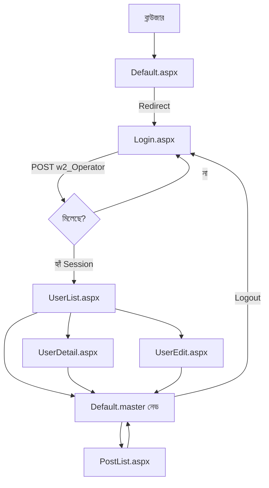

# w2.BBS.Manager — কোড ফ্লো (বাংলা)

এই ডকুমেন্ট **অ্যাডমিন প্যানেল** (`w2.BBS.Manager`) এ কোন ফাইল কী করে, ফাইলগুলো একে অপরের সঙ্গে কীভাবে জুড়ে থাকে, আর ব্যবহারকারীর চোখে **পুরো গল্পটা** সহজ ভাষায় বলে।

---

## ১) বড় ছবি — এটা আসলে কী?

- **পাবলিক সাইট** (`w2.BBS.Front`) = সাধারণ ইউজার, লিকুইড/Vue/MVC।
- **ম্যানেজার সাইট** (`w2.BBS.Manager`) = **অ্যাডমিন**, **ASP.NET Web Forms** (`.aspx`, `.master`)।

অ্যাডমিন আলাদা লগইন (`w2_Operator` টেবিল)। ইউজার/পোস্ট ম্যানেজমেন্ট = `w2_User`, `w2_ForumPost`, `w2_ForumReply`।

---

## ২) ফাইলগুলোর মানচিত্র (কে কার সঙ্গে)

```
Web.config
    └── Constants.STRING_SQL_CONNECTION (w2.Common) — সব .aspx.cs এ DB কানেকশন

styles/manager.css
    └── Default.master (head) থেকে লিংক — লুক, রং, টেবিল

App_Code/AdminSession.cs
    └── সেশন কী নাম (operator লগইন পরে)

App_Code/AdminPageBase.cs
    └── UserList, UserDetail, UserEdit, PostList — প্যারেন্ট ক্লাস
            └── লগইন ছাড়া এসব পেজে এলে → Login.aspx এ ঠেলে দেয়

Form/Common/Default.master (+ .cs + .designer.cs)
    └── উপরে নেভ: ইউজার তালিকা, পোস্ট তালিকা, লগআউট
    └── ভিতরে <asp:ContentPlaceHolder> — প্রতিটি .aspx এখানে “বসে”

Login.aspx (+ .cs)
    └── Master ব্যবহার করে (লেআউট একই)
    └── w2_Operator চেক → সেশন সেট → UserList এ রিডাইরেক্ট

UserList.aspx (+ .cs)     ─┐
UserDetail.aspx (+ .cs)   ├─ AdminPageBase ← একই master
UserEdit.aspx (+ .cs)     │
PostList.aspx (+ .cs)     ─┘

Default.aspx (+ .cs)
    └── সাইটের রুট খুললে শুধু Login.aspx এ পাঠিয়ে দেয় (দ্রুত প্রবেশ)
```

---

## ৩) গল্পের মতো পুরো ফ্লো (ইউজার যা দেখে)

### দৃশ্য ১ — প্রথম ঢোকা

১. ব্রাউজারে ম্যানেজার সাইটের ঠিকানা খুলল।  
২. `Default.aspx` চালু হয়, `Page_Load` এ **এক লাইন**: `Login.aspx` এ রিডাইরেক্ট।  
৩. `Login.aspx` লোড হয়। এটা **`Default.master`** কে মাস্টার বানিয়েছে, তাই উপরে নেভ + `manager.css` চোখে পড়ে।  
৪. অ্যাডমিন **লগইন আইডি / পাসওয়ার্ড** দিয়ে “লগইন” চাপল।

**কোডে কী হয়:** `Login.aspx.cs` → `SqlConnection(Constants.STRING_SQL_CONNECTION)` → `SELECT ... FROM w2_Operator WHERE login_id AND password`। মিললে `Session["OperatorId"]` (আর লগইন আইডি) সেট করে `UserList.aspx` এ পাঠায়।

---

### দৃশ্য ২ — ইউজার তালিকা ও খোঁজা

১. `UserList.aspx` খুলল।  
২. পেজটা **`AdminPageBase`** থেকে উত্তরাধিকার নিয়েছে। সেশনে অপারেটর নেই? তাহলে আগেই `Login.aspx` এ চলে যেত।  
৩. তালিকা: `w2_User` থেকে `Repeater` এ বাঁধা।  
৪. সার্চ বক্সে লিখে “খোঁজ” → আবার একই SQL, `LIKE` দিয়ে ফিল্টার।

**ফাইল সম্পর্ক:** `UserList.aspx` (মার্কআপ) + `UserList.aspx.cs` (ডাটা বাঁধা) + `Default.master` (চারপাশ)।

---

### দৃশ্য ৩ — একজন ইউজারের বিস্তারিত

১. তালিকায় “বিস্তারিত” চাপল → `UserDetail.aspx?id=숫자`।  
২. `UserDetail.aspx.cs` কোয়েরি স্ট্রিং থেকে `user_id` নেয়।  
৩. **প্রোফাইল:** `w2_User` থেকে `login_id`, `user_name`।  
৪. **পোস্ট:** `w2_ForumPost` — `Repeater`।  
৫. **রিপ্লাই:** `w2_ForumReply` — আরেকটি `Repeater`।  
৬. “মুছে ফেলো” → `UPDATE ... SET del_flg = 1` → আবার ওই ইউজারের তালিকা রিফ্রেশ।

**ফাইল সম্পর্ক:** শুধু `UserDetail` + মাস্টার; ফ্রন্ট প্রজেক্টের সঙ্গে সরাসরি যোগ নেই।

---

### দৃশ্য ৪ — ইউজার এডিট / ডিলিট

১. তালিকা থেকে “সম্পাদনা” → `UserEdit.aspx?id=...`।  
২. নাম সেভ → `UPDATE w2_User`। নতুন পাসওয়ার্ড খালি না থাকলে সেটাও আপডেট।  
৩. “ইউজার মুছুন” → ট্রানজাকশনে পোস্ট, রিপ্লাই, ইউজার — সব `del_flg = 1` (যেমন ফ্রন্টের অ্যাকাউন্ট ডিলিট লজিকের মতো ধারণা)।

---

### দৃশ্য ৫ — সব পোস্ট ও রিপ্লাই একসাথে

১. মাস্টার থেকে “পোস্ট তালিকা” → `PostList.aspx`।  
২. দুইটা `Repeater`: একটা **পোস্ট**, একটা **রিপ্লাই**।  
৩. সার্চ = লগইন আইডি, নাম, টাইটেল/বডি, আইডি ইত্যাদি `LIKE`।  
৪. মুছে ফেলা = `w2_ForumPost` বা `w2_ForumReply` এ `del_flg = 1`।

---

### দৃশ্য ৬ — লগআউট

১. মাস্টারের “লগআউট” → `Default.master.cs` সেশন ক্লিয়ার করে `Login.aspx`।

---

## ৪) মেরমেইড — রিকোয়েস্ট ফ্লো (চোখে চোখে)



---

## ৫) টেবিল ↔ পেজ (কোন কোড কোন টেবিল ছুঁয়েছে)

| টেবিল | কোথায় ব্যবহার |
|--------|------------------|
| `w2_Operator` | `Login.aspx.cs` — শুধু অ্যাডমিন লগইন |
| `w2_User` | `UserList`, `UserDetail` (প্রোফাইল), `UserEdit`, `PostList` (জয়েন) |
| `w2_ForumPost` | `UserDetail`, `UserEdit` (ডিলিট), `PostList` |
| `w2_ForumReply` | `UserDetail`, `UserEdit` (ডিলিট), `PostList` |

---

## ৬) ছোট টিপস

- **`Web.config`**: কানেকশন স্ট্রিং + সেশন; `|DataDirectory|` মানে সাধারণত `App_Data` এ `bbs.mdf`।  
- **`AdminPageBase`**: `Login.aspx` বাদে বাকি পেজে “গার্ড”; না হলে চুরি করে URL খুলেও ভিতরে ঢুকতে পারবে।  
- **`Default.master`**: স্লাইড অনুযায়ী নেভিগেশন “প্রতি পেজে”; `Menu` কন্ট্রোল নয়, `LinkButton` + `Literal`।  
- **স্টাইল**: স্লাইড বলেছে সাধারণ টেক্সটের জন্য `Label` নয় — `Literal` + **বাইরের CSS** (`manager.css`)।

---

## ৭) এক লাইনে সারাংশ

**গল্প:** রুট খুললে লগইন → অপারেটর চেক → সেশন → মাস্টারের নেভ দিয়ে ইউজার/পোস্ট স্ক্রিনে ঘোরা → SQL দিয়ে দেখানো/খোঁজা/মোছা → লগআউটে সেশন শেষ।

এই ফ্লোটাই `manager.md` এ ধরা হয়েছে যাতে কোড পেস্ট করার পরও **কোন ফাইল কেন আছে** মাথায় থাকে।
